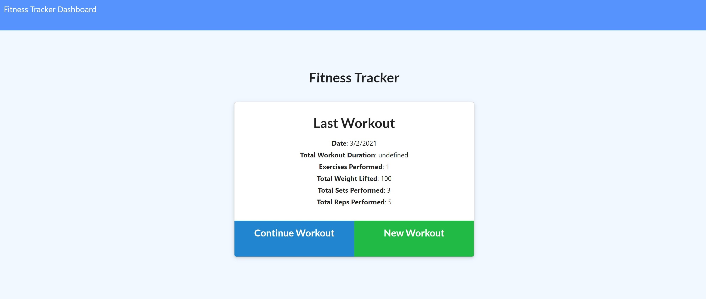
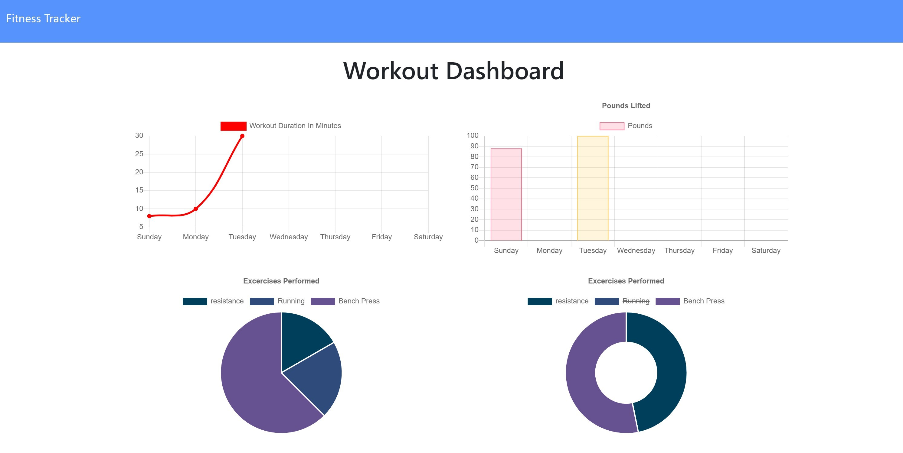

# Active-Workout-Tracker

  ## Table of Contents
  * [Description](#description)
  * [Installation](#installation)
  * [Usage](#usage)
  * [Deployed](#deployed)
  * [License](#license)
  * [Contributing](#contributing)

  ## Description
  The Active-WorkoutTracker is a daily workout tracker. Users can log multiple exercises in a workout on any given day. Additionally, users can track the name, type, weight, sets, reps, duration, and distance of each exercise, depending on whether the type of exercise is cardio or resistance. 

  The front-end of the application was already created. My task was to create the back end of the application and connect it to a NoSQL database. In this case, I used MongoDB. 

  When working on this application, some of the challenges that arouse include getting familiar with the code already provided. Once I got familiar with the structure of the application and its functionality, I continued and finalized the application. 
    
  By working on the application, I learned how to work with NoSQL databases such as MongoDB and MongoDB Atlas to connect the Database on Heroku. 

  The application is hosted in Heroku, and the Database is connected from MongoDB Atlas. 
    
 

  The technologies used include: 
  * Node.js
  * CSS
  * HTML
  * Express
  * MongoDB
  * Mongoose.js
  * MongoDB Atlas
  * Heroku
  
  ## Installation
  To start the application on VS-Code:
  * npm install 
  * npm start

  ## Usage 
  This is a preview of how the Web application Looks Like: 

  

  ## Deployed Application 
  The link to the published application can be accessed on the following link: 
  https://active-workout-tracker.herokuapp.com/.

  ## License
  Licensed under the MIT license.

  ## Badges
  
  

  ## Contributing
  To contribute to this README generator you can create a pull request or email me at mariaocampo0513@gmail.com for more questions.

  >[This repository] is under exclusive copyright by default. [You cannot] use, copy, distribute, or modify without being at risk of take-downs, shake-downs, or litigation.

  - - -
  Copyright &copy; 2020 Maria Ocampo. All Rights Reserved.
